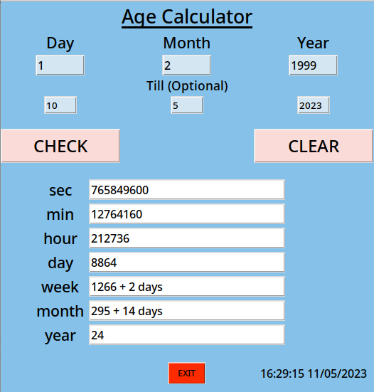
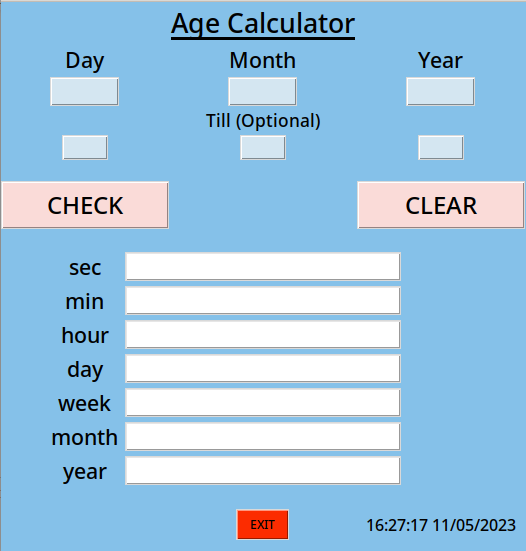

# Age Calculator
<pre></pre>
<h3>About</h3>
Age calculator is a simple program for calculating age from inputed date to the current date or a specific date. 
time is always constant(<i>current international time</i>) while calculating the age.
this is a GUI version and <b>you dont need extra packages to use this application.</b> Just download, run and enjoy.

  

  

  

<h3>Download & Run</h3>

Open terminal and run, 
<pre>
git clone https://github.com/mursalatul/Age_Calculator.git 
cd Age_Calculator 
python age_calculator.py (windows) 
python3 age_calculator.py (max/linux) 
</pre>
